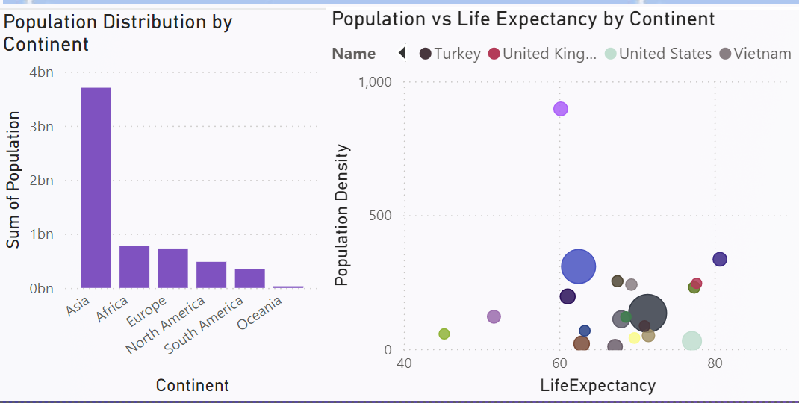
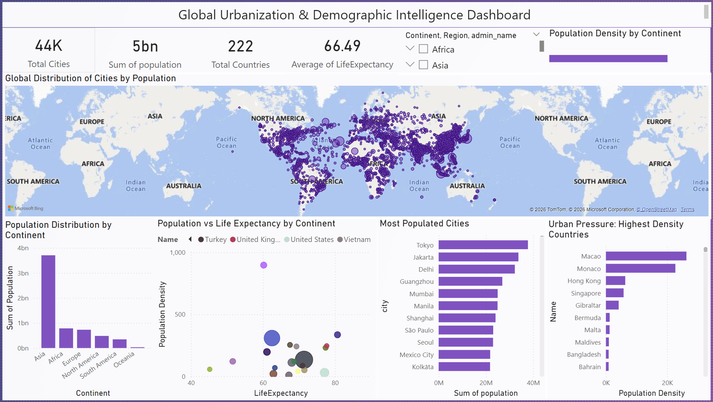
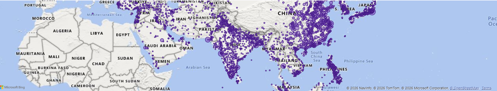

#  Global Urbanization and Demographic Intelligence Analysis

##  Project Overview
An end-to-end data analytics project analyzing global cities and country-level demographic data using MySQL for data processing and Power BI for interactive visualization.

This project demonstrates database design, ETL processes, SQL-based analysis, and direct integration with Power BI via localhost connection.

---

##  Business Objective
To analyze global urbanization patterns and demographic trends by:
- Understanding population distribution across continents
- Identifying most populated cities
- Analyzing population density and urban pressure
- Exploring relationships between life expectancy and population metrics

---

##  Tech Stack
- **MySQL** (Data Cleaning & Analytical Queries)
- **Power BI** (Interactive Dashboard & Visualization)
- **CSV Dataset** (World Cities & Countries Data)

---

##  Data Pipeline
Raw CSV → MySQL ETL → Clean Tables → Power BI (Direct DB Connection via localhost) → Dashboard

---

##  Key Insights
- Global population distribution by continent
- Most populated cities worldwide
- Population density analysis
- Population vs Life Expectancy trends
- Urbanization pressure by country

---

##  Dashboard Preview

## Dashboard Preview

### 🌍 Full Dashboard

### 📊 Population Distribution

### 🏙 Most Populated Cities

### 📈 Population vs Life Expectancy

### 🧭 Urbanization Pressure

